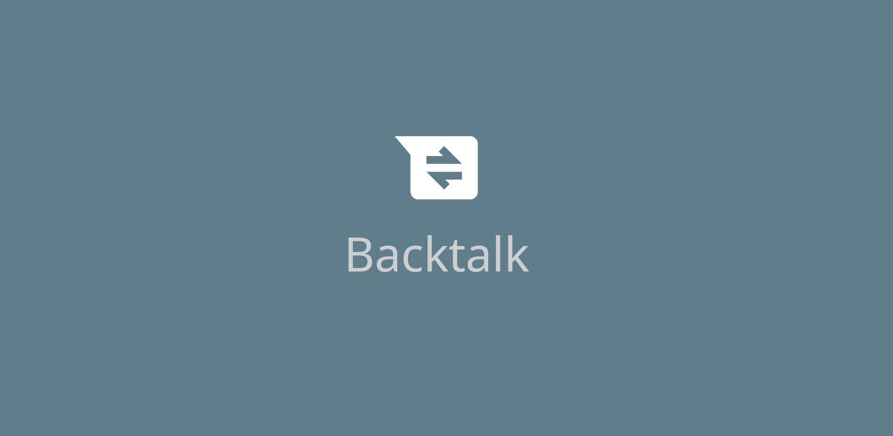
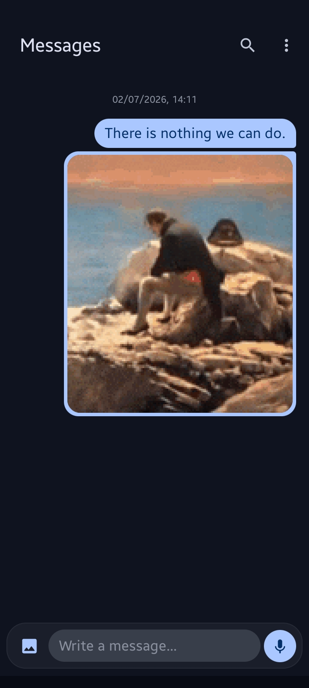
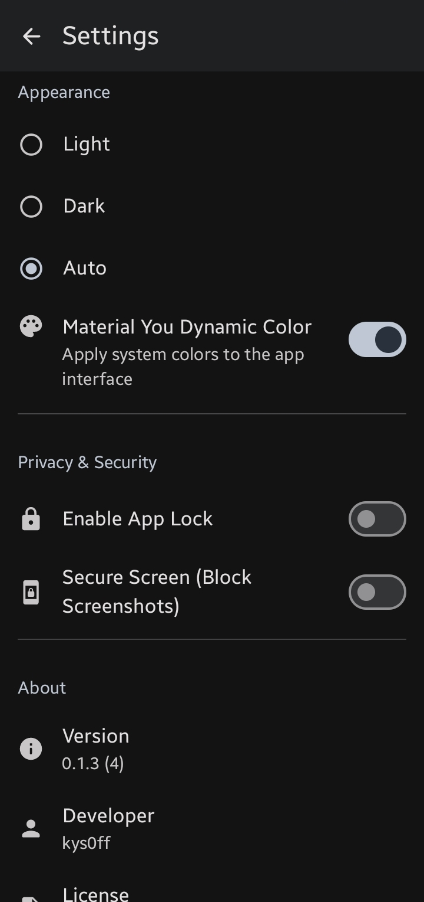
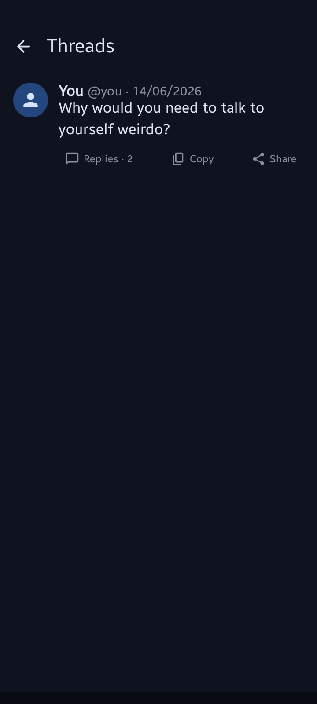
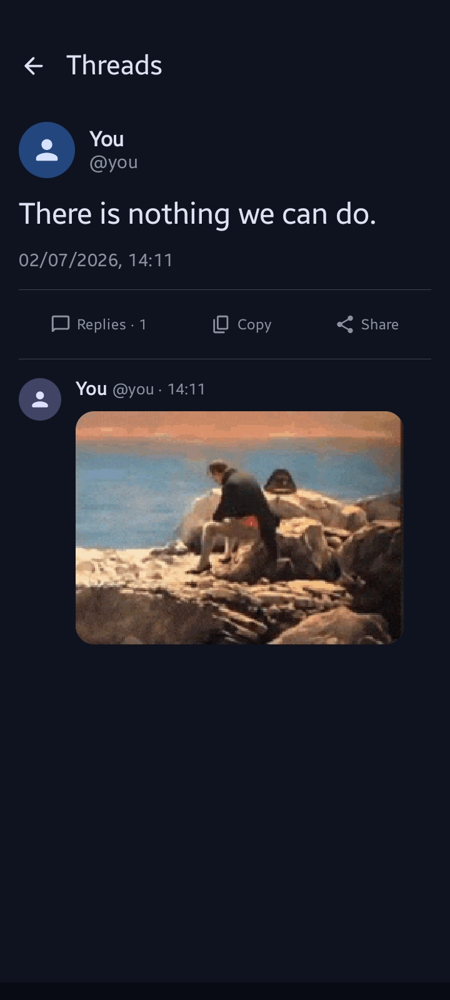
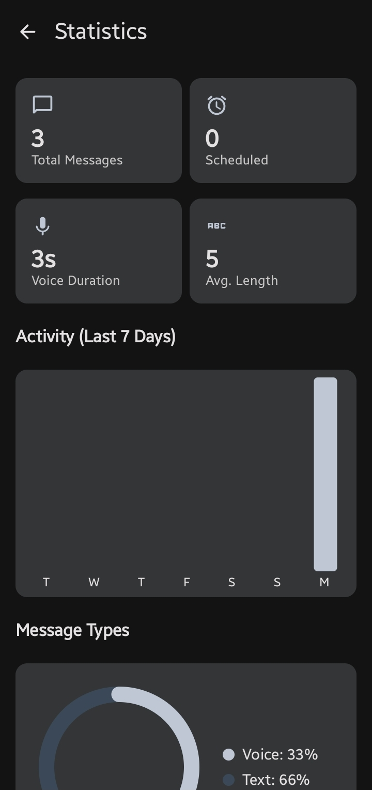
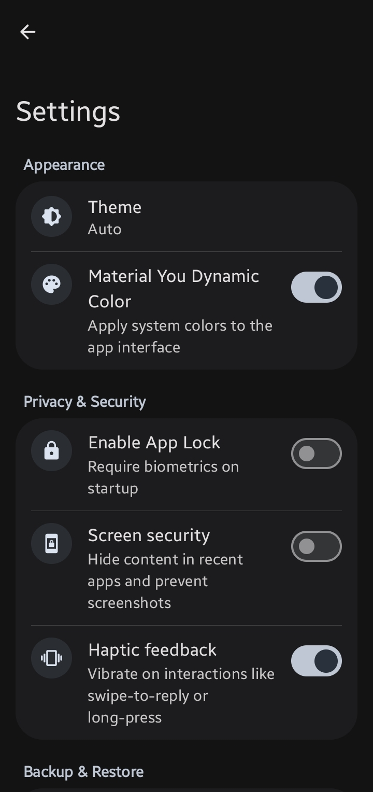

> [!TIP]
> **Enjoying the app?** Give it a **Star** to show your support!
>
> `[ ★ Star ]` ➔ `[ 🌟 Starred ]`

---

<p align="center">
  
</p>

# <p align="center">Backtalk 🗨️</p>

<p align="center">
  
  
  
  
  
  
  
  <a href="https://liberapay.com/kys0ff"></a>
</p>

**Backtalk** is a private, self-chat notes app built with **Kotlin** and **Jetpack Compose**. It
provides a familiar chat interface to talk to yourself—reply, reflect, and organize your
thoughts—with a strong focus on privacy and simplicity.

> *Backtalk — because sometimes the most important conversation is the one where you talk back to
yourself.*

---

## Philosophy

Backtalk is guided by a strict set of architectural principles to ensure it remains a fast, private, and focused sanctuary for raw thought. 

- **The Immutable Timeline**: A single, continuous stream. No folders, no fragments.
- **Lightweight & Fast**: Optimized for near-zero capture latency.
- **Local-First Privacy**: Your data belongs to your hardware, period.

Read the full [Backtalk Philosophy](./PHILOSOPHY.md) to learn more about why we build the way we do.

---

## Screenshots

|                                                                                                          |                                                                                                          |
|:--------------------------------------------------------------------------------------------------------:|:--------------------------------------------------------------------------------------------------------:|
|  |  |
|  |  |
|  |  |

---

## Features

- **Media Support**: Attach images from your gallery or capture them directly with the built-in camera.
- **Message Pinning**: Keep important notes at the top for easy access.
- **Hashtags & Reminders**: Organize your thoughts with tags and never forget a note with reminders.
- **Self-Chat Interface**: Write messages and reply to yourself in a familiar layout.
- **Threaded Conversations**: Easily organize replies to specific thoughts.
- **Biometric Security**: Protect your notes with fingerprint or face unlock.
- **Secure Backups**: Periodic automatic backups with encryption support.
- **Material 3 Design**: Modern, clean UI that adapts to your device.
- **Offline-First**: All data stays on your device, no internet required.
- **Intuitive Gestures**: Swipe to edit or reply to messages for a seamless flow.

## Recent Changes (v0.4.0)

- **Image Compression**: New processing pipeline with quality settings for attachments.
- **Backup Retention**: Automated cleanup of old backups to save storage.
- **Media Picker**: Added folder-based filtering and optimized memory usage.
- **Status Feedback**: Centralized global loading and error banners using `GlobalStatusHost`.
- **Input Experience**: ViewModel-driven input bar for smoother interactions and state management.
- **Build**: Modernized toolchain with AGP 9.3.0, Gradle 9.6.1, and Kotlin 2.4.10.

See the full [CHANGELOG.md](./CHANGELOG.md) for more details.

---

## Tech Stack

- **UI Framework**: [Jetpack Compose](https://developer.android.com/jetpack/compose) with Material3.
- **Navigation**: [Voyager](https://voyager.adriel.cafe/) for multiplatform-friendly navigation.
- **Dependency Injection**: [Koin](https://insert-koin.io/) for lightweight DI.
- **Database**: [Room](https://developer.android.com/training/data-storage/room) for local
  persistence.
- **Background Work**: [WorkManager](https://developer.android.com/topic/libraries/architecture/workmanager) for
  periodic backups.
- **Architecture**: Clean MVVM architecture.

---

## Getting Started

### Download

<a href="https://f-droid.org/en/packages/off.kys.backtalk">
  
</a>

You can also find the latest APKs on the [Releases](../../releases/latest) page.

### Building from Source

1. **Clone the repository**:
   ```bash
   git clone https://github.com/kys0ff/Backtalk.git
   cd Backtalk
   ```
2. **Open in Android Studio**: Use Android Studio Ladybug or newer for the best experience.
3. **Run**: Sync Gradle and deploy to your device or emulator.

---

## Privacy & Security

Backtalk is built on the principle of **Privacy by Design**:

- **Local Only**: Your notes never leave your device unless you manually export/sync them.
- **No Analytics**: We don't track you. No telemetry, no logs, no trackers.
- **Encryption**: Manual and automatic exports can be encrypted for extra security.

---

## Contributing

Contributions are welcome! If you'd like to improve Backtalk:

1. Fork the repository.
2. Create a feature branch (`git checkout -b feature/amazing-feature`).
3. Commit your changes (`git commit -m 'Add some amazing feature'`).
4. Push to the branch (`git push origin feature/amazing-feature`).
5. Open a Pull Request.

---

## Support Development

If you find Backtalk useful, consider supporting its development
via [Liberapay](https://liberapay.com/kys0ff). Every contribution helps keep the project alive and
open source!

## License

Backtalk is licensed under the **MIT License**. See the [LICENSE](./LICENSE) file for more
information.

Copyright © 2026 **kys0ff**
